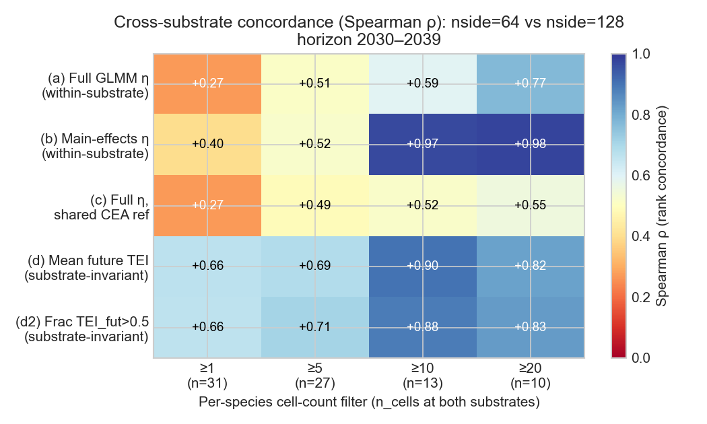
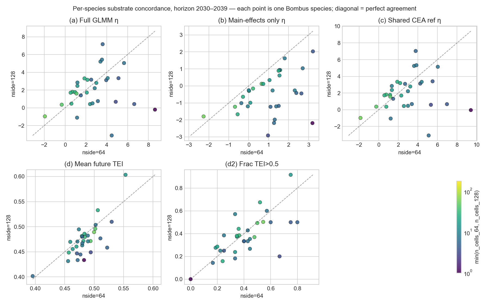

# weatherxbiodiversity-substrate-sensitivity

> **Substrate-sensitivity diagnostic for TEI-based extirpation projection.**
> Per-species ranking under future climate is grid-coupled at the projection step. Here is the mechanism, and three principled fixes.

This repository is a **methodological follow-up** to two single-substrate replications of Soroye et al. 2020 ([10.1126/science.aax8591](https://doi.org/10.1126/science.aax8591)) for Iberian *Bombus* under DestinE Climate DT SSP3-7.0:

| Substrate | Repo | Purpose |
|---|---|---|
| HEALPix nside=64 (~92 km) | [`weatherxbiodiversity-projection`](https://github.com/annefou/weatherxbiodiversity-projection) | canonical replication |
| HEALPix nside=128 (~46 km) | [`weatherxbiodiversity-projection-nside128`](https://github.com/annefou/weatherxbiodiversity-projection-nside128) | resolution extension |

Both single-substrate Outcomes are **Substrate-robust**: the GLMM coefficient on `sc_TEI_delta` is positive, large, and credible at all three pixelisations (CEA, nside=64, nside=128) — within ±30%. **Soroye's central biological claim replicates on Iberian *Bombus*.**

But when the same GLMM is asked to **project** to future climate, per-species rankings diverge across substrates by 1–9 logits. This repo asks: why does that happen, and how should it be done properly?

## Headline finding

Substrate-coupling is **not** caused by per-species random-effect refit (substrate-stable, ΔRE ≤ 0.6 logits) or per-species niche-limit refit (modest, ΔT_range = 0–3°C). It is caused by **two mechanisms acting together**:

1. **Per-species sample size at projection time.** Below ~10 occupied + active cells per substrate, per-cell extrapolation noise dominates the species mean η, regardless of which projection variant is used.
2. **The GLMM interaction term `sc_TEI_delta:sc_PEI_delta` compounds substrate-specific standardisation quadratically when future predictors extrapolate 2–4σ outside the training distribution.** The same physical climate signal z-scores to opposite tails of the standardised distribution under each substrate's local (μ, σ); the interaction term scales as the product, amplifying the divergence.

## Per-species view

Each panel is one of the five projection variants. The diagonal is perfect agreement between substrates. Yellow dots (n_cells ≥ 50) sit on the diagonal in every variant; dark dots (n_cells ≤ 5) sit far off. The substrate-invariant physical metrics (d) and (d2) bring the small-N species back toward the diagonal.

## Recommended reporting protocol

For any future TEI-based extirpation projection that compares across substrates:

1. **Report only on species with ≥ 10 occupied + active cells per substrate.**
2. **Drop the GLMM interaction terms at projection time** — keep them in the fit, but use main-effects-only η to extrapolate. At n≥10 this lifts the cross-substrate Spearman ρ from +0.59 to **+0.97** (mid-term horizon, both substrates).
3. **Cross-check against a substrate-invariant physical metric** — mean future TEI, or fraction of cells where future TEI > 0.5. Both hit ρ ≥ 0.66 across the entire species set including small-N species.

See [`results/SUBSTRATE_SENSITIVITY_FINDINGS.md`](https://github.com/annefou/weatherxbiodiversity-substrate-sensitivity/blob/main/results/SUBSTRATE_SENSITIVITY_FINDINGS.md) for the full evidence — variant comparison tables at both horizons, decomposition of η into 10 GLMM terms per species, and refuted hypotheses.

## Pipeline

The four-notebook pipeline is documented in the chapter list on the left:

- **01 — Inputs fetch.** Symlinks (development) or downloads (Zenodo) the upstream substrate artefacts.
- **02 — Decompose.** Per-species η decomposition diagnostic at the SSP3-7.0 mid-term horizon (12 diagnostic species).
- **03 — Variants.** Five-variant cross-substrate Spearman concordance at both horizons (2020–2029 and 2030–2039).
- **04 — Figures.** Concordance heatmap + per-variant scatter pair-plots.

## Citation

If you use this work, please cite:

- This software: [`CITATION.cff`](https://github.com/annefou/weatherxbiodiversity-substrate-sensitivity/blob/main/CITATION.cff) → DOI [{{ZENODO_DOI}}]({{ZENODO_DOI}}).
- The original paper: [10.1126/science.aax8591](https://doi.org/10.1126/science.aax8591).
- The two upstream substrate replications via their own DOIs (see CITATION.cff `references`).
